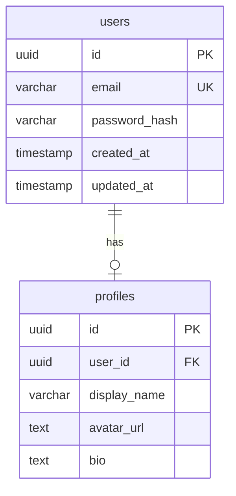

---
# ⚠️ DEPRECATED — MIGRATED TO PLUGIN
# This skill has been migrated to: plugins/sdd-domain-database/skills/schema-design/
# Use the plugin version instead. This file will be removed in v5.0.
# Migration date: 2026-01-15
---

---
name: schema-design
version: 3.0.0
category: domain
description: Designs database schemas, data models, and entity relationships
triggers:
  - schema design
  - data model
  - entity design
  - ERD
  - database design
  - table structure
rl_metrics:
  success_rate: 0.0
  selection_weight: 0.5
  invocation_count: 0
  avg_tokens: 0
progressive-disclosure:
  layer-1-metadata:
    description: "Handles database schema and data model design"
    triggers: [schema, data model, ERD, entity]
    primary-agent: database-specialist
  layer-2-instructions: true
  layer-3-examples: true
agent-invocations:
  - agent: database-specialist
    context-subset:
      - entities
      - relationships
      - constraints
      - indexes
    expected-output: schema_definition
ds-star:
  pre-execution: validation/message-preflight
  post-verification: true
  auto-debug: conditional
---

# Schema Design Skill

## Purpose

Designs database schemas, data models, entity relationships, and database
constraints. Supports both relational and NoSQL database design patterns.

## Constitutional Compliance

- **Principle III (Contract-First)**: Schema contracts before implementation
- **Principle X (Skills-First)**: Skill orchestrates, database-specialist executes

## Instructions

### Step 1: Identify Entities

From requirements, identify:
- Core entities
- Supporting entities
- Junction tables (for M:N)
- Audit/history tables

### Step 2: Define Relationships

Map relationships:
```yaml
relationships:
  - type: one-to-many
    from: User
    to: Order
    foreign_key: user_id

  - type: many-to-many
    entities: [User, Role]
    junction: user_roles
```

### Step 3: Design Schema

For each entity:
```yaml
entity: User
columns:
  - name: id
    type: uuid
    primary: true
    default: gen_random_uuid()

  - name: email
    type: varchar(255)
    unique: true
    nullable: false

  - name: created_at
    type: timestamp
    default: now()

indexes:
  - columns: [email]
    unique: true

constraints:
  - type: check
    column: email
    condition: "email ~* '^[A-Za-z0-9._%+-]+@[A-Za-z0-9.-]+\\.[A-Z]{2,}$'"
```

### Step 4: Generate Artifacts

Produce:
- SQL DDL statements
- ERD diagram (mermaid)
- Migration files
- TypeScript interfaces

## Agent Invocation

```yaml
invoke: database-specialist
context:
  entities: ["<entity1>", "<entity2>"]
  relationships: [<relationships>]
  database_type: "postgresql | mysql | mongodb"
  include_rls: <boolean>
expected:
  format: schema_definition
  artifacts: [ddl, erd, migrations, types]
```

## Examples

### Example 1: Design User Schema

**Request**: "Design schema for users and their profiles"

**Output**:
```sql
-- Users table
CREATE TABLE users (
  id UUID PRIMARY KEY DEFAULT gen_random_uuid(),
  email VARCHAR(255) UNIQUE NOT NULL,
  password_hash VARCHAR(255) NOT NULL,
  created_at TIMESTAMP DEFAULT NOW(),
  updated_at TIMESTAMP DEFAULT NOW()
);

-- Profiles table
CREATE TABLE profiles (
  id UUID PRIMARY KEY DEFAULT gen_random_uuid(),
  user_id UUID REFERENCES users(id) ON DELETE CASCADE,
  display_name VARCHAR(100),
  avatar_url TEXT,
  bio TEXT,
  UNIQUE(user_id)
);

-- Indexes
CREATE INDEX idx_users_email ON users(email);
CREATE INDEX idx_profiles_user_id ON profiles(user_id);
```

**ERD**:


## Error Handling

| Scenario | Detection | Resolution |
|----------|-----------|------------|
| Missing entity | Analysis | Infer from relationships |
| Invalid relationship | Validation | Suggest corrections |
| Missing indexes | Performance | Recommend based on queries |

## RL Metrics

- **Success Criteria**: Schema validates and migrations apply
- **Token Efficiency**: < 800 tokens per entity


## RL Feedback Loop

After skill execution completes, the RL feedback mechanism updates metrics:

### Success Criteria
- Task completed without errors
- Output validated by verifier (if applicable)
- User satisfaction (implicit from follow-up)

### Feedback Collection
```
ON SKILL COMPLETION:
  1. Capture execution result (success/failure)
  2. Record token usage
  3. Calculate execution duration
  4. Update rl_metrics via EMA:
     - success_rate = 0.9 * old_rate + 0.1 * (1 if success else 0)
     - selection_weight = adjusted based on success_rate
  5. Log to .docs/rl-metrics/skill-performance.json
```

### Metrics Update Trigger
```python
# Pseudo-code for RL update
def update_rl_metrics(skill_name: str, success: bool, tokens: int):
    metrics = load_skill_metrics(skill_name)
    metrics['invocation_count'] += 1
    metrics['success_rate'] = 0.9 * metrics['success_rate'] + 0.1 * (1 if success else 0)
    metrics['avg_tokens'] = 0.9 * metrics['avg_tokens'] + 0.1 * tokens
    metrics['selection_weight'] = max(0.1, min(1.0, metrics['success_rate']))
    metrics['last_feedback'] = datetime.utcnow().isoformat()
    save_skill_metrics(skill_name, metrics)
```


## Verifier Integration

### Pre-Completion Validation
Before marking this skill as complete, invoke verifier validation:

```
VERIFIER_CHECK:
  1. Output format validation
  2. Constitutional compliance check
  3. Quality threshold verification
  4. Domain-specific validation rules
```

### Verifier Handoff
```json
{
  "skill": "schema-design",
  "output": "<skill_output>",
  "validation_required": ["format", "compliance", "quality"],
  "threshold": 0.85
}
```

### On Verification Failure
- Log failure reason
- Update rl_metrics with failure
- Report to user with remediation options

## Related Skills

- **domain/database-operations**: Implementation
- **domain/backend-operations**: API integration

---

*Domain skill version: 3.0.0*
