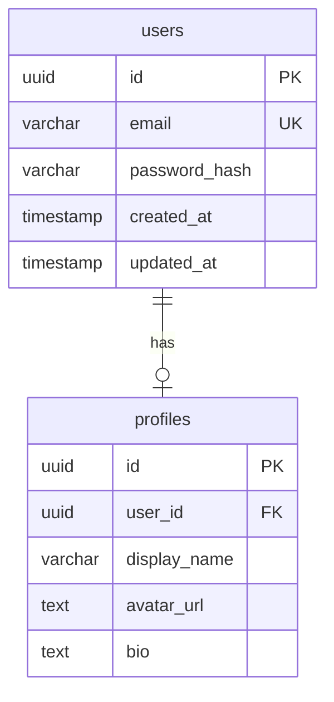

# Schema Design Skill

## Purpose

Designs database schemas, data models, entity relationships, and database
constraints. Supports both relational and NoSQL database design patterns.

## Task Brief

You are a database schema design specialist working on a team task. Your expertise includes:
- **Schema Design**: Entity-relationship modeling, normalization (1NF-5NF), strategic denormalization
- **Data Types**: Optimal type selection, UUID vs serial keys, JSONB columns, array types
- **Constraints**: Primary keys, foreign keys, unique constraints, check constraints, exclusion constraints
- **Indexing**: B-tree, GIN, GiST, partial indexes, composite indexes, covering indexes
- **Relationships**: One-to-one, one-to-many, many-to-many with junction tables, polymorphic associations
- **Migration Design**: Forward-only migrations, reversible changes, zero-downtime schema changes
- **Multi-Tenant**: Row-level security (RLS), schema-per-tenant, discriminator columns

**Quality Standards**:
- Schema contracts defined BEFORE implementation (Principle III - Contract-First)
- All entities have UUID primary keys with gen_random_uuid() defaults
- created_at and updated_at timestamps on all mutable tables
- Foreign keys with explicit ON DELETE/ON UPDATE behavior
- Indexes on all foreign key columns and frequently queried fields
- ERD diagrams generated in Mermaid format for documentation
- TypeScript interfaces generated to match schema definitions
- Test-First Development (Principle II): migration tests with rollback verification

**File Ownership**: You own files matching: `supabase/migrations/**`, `src/db/schema/**`, `*.sql`, `specs/*/data-model.md`

## Constitutional Compliance

- **Principle III (Contract-First)**: Schema contracts before implementation
- **Principle X (Skills-First)**: Skill orchestrates, schema-design skill (sdd-domain-database) executes

## Instructions

### Step 1: Identify Entities

From requirements, identify:
- Core entities
- Supporting entities
- Junction tables (for M:N)
- Audit/history tables

### Step 2: Define Relationships

Map relationships:
```yaml
relationships:
  - type: one-to-many
    from: User
    to: Order
    foreign_key: user_id

  - type: many-to-many
    entities: [User, Role]
    junction: user_roles
```

### Step 3: Design Schema

For each entity:
```yaml
entity: User
columns:
  - name: id
    type: uuid
    primary: true
    default: gen_random_uuid()

  - name: email
    type: varchar(255)
    unique: true
    nullable: false

  - name: created_at
    type: timestamp
    default: now()

indexes:
  - columns: [email]
    unique: true

constraints:
  - type: check
    column: email
    condition: "email ~* '^[A-Za-z0-9._%+-]+@[A-Za-z0-9.-]+\\.[A-Z]{2,}$'"
```

### Step 4: Generate Artifacts

Produce:
- SQL DDL statements
- ERD diagram (mermaid)
- Migration files
- TypeScript interfaces

## Agent Invocation

```yaml
invoke: schema-design skill (sdd-domain-database)
context:
  entities: ["<entity1>", "<entity2>"]
  relationships: [<relationships>]
  database_type: "postgresql | mysql | mongodb"
  include_rls: <boolean>
expected:
  format: schema_definition
  artifacts: [ddl, erd, migrations, types]
```

## Examples

### Example 1: Design User Schema

**Request**: "Design schema for users and their profiles"

**Output**:
```sql
-- Users table
CREATE TABLE users (
  id UUID PRIMARY KEY DEFAULT gen_random_uuid(),
  email VARCHAR(255) UNIQUE NOT NULL,
  password_hash VARCHAR(255) NOT NULL,
  created_at TIMESTAMP DEFAULT NOW(),
  updated_at TIMESTAMP DEFAULT NOW()
);

-- Profiles table
CREATE TABLE profiles (
  id UUID PRIMARY KEY DEFAULT gen_random_uuid(),
  user_id UUID REFERENCES users(id) ON DELETE CASCADE,
  display_name VARCHAR(100),
  avatar_url TEXT,
  bio TEXT,
  UNIQUE(user_id)
);

-- Indexes
CREATE INDEX idx_users_email ON users(email);
CREATE INDEX idx_profiles_user_id ON profiles(user_id);
```

**ERD**:


## Error Handling

| Scenario | Detection | Resolution |
|----------|-----------|------------|
| Missing entity | Analysis | Infer from relationships |
| Invalid relationship | Validation | Suggest corrections |
| Missing indexes | Performance | Recommend based on queries |

## RL Metrics

- **Success Criteria**: Schema validates and migrations apply
- **Token Efficiency**: < 800 tokens per entity
## Related Skills

- **domain/database-operations**: Implementation
- **domain/backend-operations**: API integration

---

*Domain skill version: 3.0.0*
